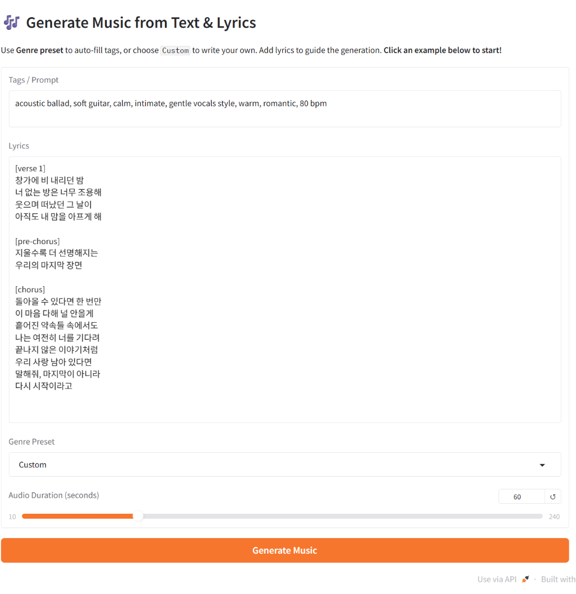
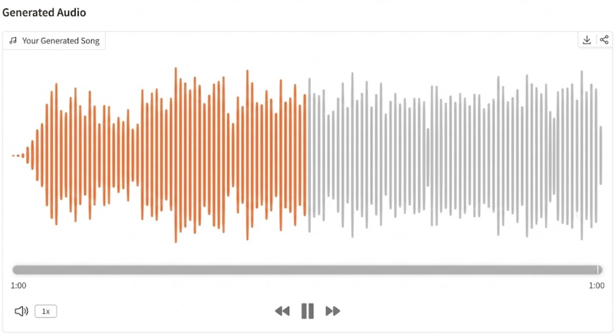
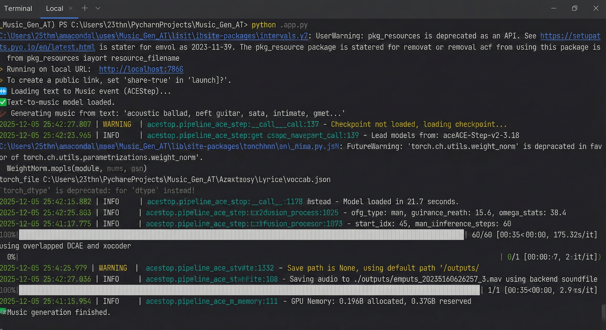

# Text-to-Music Generator: Flow-Matching with Linear DiT

이 프로젝트는 멜로디와 가사가 있는 고품질의 노래를 생성할 수 있는 차세대 텍스트 기반 음악 생성(Text-to-Music) 시스템을 구현합니다. 이 모델은 **Linear DiT** 아키텍처와 **Flow-Matching** 방법론을 기반으로 구축되었으며, **Acestep**과 **Chatterbox** 라이브러리를 통합하여 학습 프로세스와 데이터 처리를 최적화했습니다.

이 프로젝트의 목표는 텍스트, 가사, 보컬 특징을 통해 결과물을 정밀하게 제어하는 동시에, 기존의 확산(diffusion) 모델 대비 연산 비용을 절감하는 것입니다.

## 🚀 주요 기능 (Key Features)

이 시스템은 음악 생성 분야의 주요 과제들을 해결하기 위해 다음과 같은 핵심 기능들로 설계되었습니다:

* **고품질 음악 생성:** 44.1kHz 표준 오디오를 지원하여 음악에 필요한 주파수 대역을 온전히 보존합니다.
* **다양한 제어 기능:** 텍스트 설명(prompt), 가사(lyrics), 보컬 샘플(speaker embedding)을 기반으로 음악을 생성할 수 있습니다.
* **빠른 생성 속도:** **Flow-Matching** 알고리즘을 사용하여 연속적인 벡터 필드를 학습함으로써, 기존 Diffusion 방식보다 훨씬 적은 10~100 단계(step) 만에 추론이 가능합니다.
* **정확한 가사 정렬:** **REPA** (Representation Alignment) 메커니즘을 통합하여 모델의 표현이 음성 모델과 일치하도록 강제함으로써, 가사가 정확한 타이밍에 명확하게 발음되도록 합니다.

## 🛠️ 시스템 아키텍처 (Architecture)


시스템은 다음과 같이 긴밀하게 연결된 파이프라인의 핵심 구성 요소들로 이루어져 있습니다:

1.  **Music-DCAE (Desensitized Convolutional Autoencoder):** 고차원의 Mel-spectrogram 데이터를 컴팩트한 잠재 공간(latent space)으로 압축(압축률 f8c8)하여 생성 모델의 연산 비용을 줄이는 역할을 합니다.
2.  **Linear DiT (Diffusion Transformer):** 시스템의 "심장" 역할을 하며, 효율적인 Attention과 1D-Convolution이 통합된 FFN을 사용하여 잠재 시퀀스 내의 장기 의존성(멜로디, 화성 등)을 학습합니다.
3.  **Conditioning Encoders:** **Chatterbox**와 기타 인코더(mT5, Lyric Encoder 등)를 사용하여 문맥 정보를 처리하고, Adaptive Layer Normalization (AdaLN) 메커니즘을 통해 DiT에 정보를 주입합니다.
4.  **Flow-Matching Decoder:** 상미분방정식(ODE)을 풀어 노이즈를 깨끗한 오디오 데이터로 변환합니다.

## 📦 설치 (Installation)

Python 3.12 및 CUDA를 지원하는 GPU 환경이 필요합니다 (RTX 4080 이상 24GB RAM).

```bash
# 1. 리포지토리 복제
git clone https://github.com/your-username/text-to-music-project.git
cd text-to-music-project](https://github.com/TRANDUYDAT21101233/Text_to_Music_Gen.git)

# 2. 주요 의존성 라이브러리 설치
pip install -r requirements.txt
pip install --upgrade diffusers[torch]

# 3. Model 설치 (12GB)

git clone https://huggingface.co/thang101020/musicai

# 4. how to run?

python app.py

click in the link on terminal like "Running on local URL:  http://localhost:7860"

write Tags / Prompt -> Lyrics -> edit Audio Duration (seconds) -> click Generate Music

## 🎨 실험 결과 (Experimental Results)

아래는 실제로 본 모델을 사용해 생성한 예시들입니다. (44.1kHz 스테레오, 10~60 step 내 생성)

### 1. 생성 예시 1 – 감성 발라드 (Emotional Ballad)

**Prompt + Lyrics:**


**결과 (약 35초 길이, 60 steps):**

<audio controls>
  <source src="Result_Image_Demo/output_20251205024257_0.wav" type="audio/wav">
  Your browser does not support the audio element.
</audio>



### 3. 추론 속도 비교 (동일 prompt, 30초 길이, RTX 4090 vs GTX 1065 6GB)

| GPU              | VRAM   | Steps | 생성 시간    | 비고                  |
|------------------|--------|-------|--------------|------------------------|
| RTX 4090         | 24 GB  | 60    | **35초**    | 매우 빠름                  |
| GTX 1065         | 4 GB   | 60    | ~3시간       | 느림                      |




